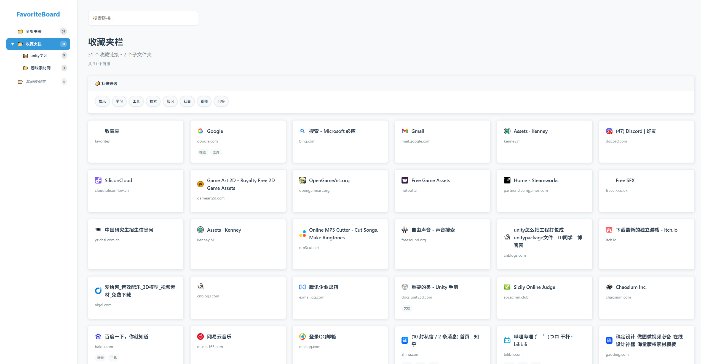

# FavoriteBoard Plugin



> ⚠️ 当前版本仅适配 Microsoft Edge 浏览器，暂不支持 Chrome、Firefox 等其他浏览器。

基于 Edge 扩展的现代化收藏夹管理面板，将浏览器收藏夹转换为美观的卡片式界面。

## ✨ 功能特性

- 🔗 **智能收藏夹管理**：自动同步 Edge 浏览器收藏夹数据
- 📊 **可视化统计**：收藏夹数量、文件夹、标签等统计信息
- 🏷️ **自动标签生成**：根据域名和 URL 自动生成标签，过滤无意义后缀
- 🔍 **强大搜索功能**：支持标题、URL、标签多维度搜索
- 📱 **响应式设计**：适配各种屏幕尺寸，移动端体验友好
- 🎨 **现代化界面**：卡片式设计，美观易用
- ⚡ **实时同步**：收藏夹变更时自动更新，无需手动刷新

## 🚀 使用方法

1. **安装扩展**：在 Edge 浏览器扩展管理页面加载解压缩扩展（开发者模式）
2. **点击图标**：点击工具栏中的 FavoriteBoard 扩展图标
3. **管理收藏夹**：在新打开的标签页中高效管理你的收藏夹

## 📁 项目结构

```
FavoriteBoardPlugin/
├── manifest.json          # 扩展配置文件
├── background.js          # 后台服务脚本（Service Worker）
├── index.html             # 主界面页面
├── css/                   # 样式文件
│   ├── reset.css
│   ├── style.css
│   └── responsive.css
├── js/                    # JavaScript 业务逻辑
│   ├── main.js            # 主应用逻辑
│   ├── bookmarks.js       # 收藏夹管理器
│   ├── utils.js           # 工具函数
│   └── tag-manager.js     # 标签管理器
├── assets/                # 资源文件
│   ├── icons/             # 图标文件
│   └── images/            # 截图、示意图等
└── README.md              # 项目说明文档
```

## 🛠️ 技术栈

- **Manifest V3**：Edge 最新扩展规范
- **Edge Bookmarks API**：收藏夹数据获取与管理
- **Vanilla JavaScript**：无依赖纯 JS 实现，兼容性强
- **CSS Grid & Flexbox**：现代响应式布局
- **SVG Icons**：高质量矢量图标

## 🔧 开发说明

### 权限说明
- `bookmarks`：读取和管理 Edge 收藏夹
- `storage`：本地数据缓存与同步
- `tabs`：标签页管理
- `favicon`：网站图标获取

### 主要组件
- **BookmarkManager**：收藏夹数据管理与标签生成
- **ToolboxApp**：主应用界面逻辑与交互
- **TagManager**：标签系统管理与建议

## 📝 更新日志

### v1.0.0
- ✅ 点击扩展图标打开收藏夹面板
- ✅ 动态收藏夹文件夹分类与管理
- ✅ 自动标签生成和筛选，过滤无意义后缀
- ✅ 实时数据同步，无需手动刷新
- ✅ 响应式界面设计，适配多端

## 🤝 贡献

欢迎提交 Issue 和 Pull Request！如有建议或发现问题，欢迎在 GitHub 反馈。

## �� 许可证

MIT License 