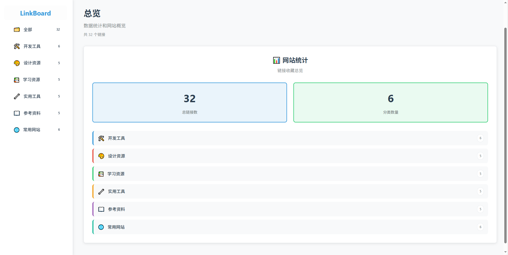
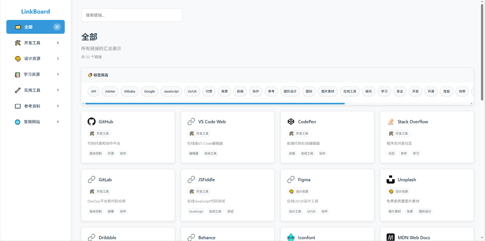
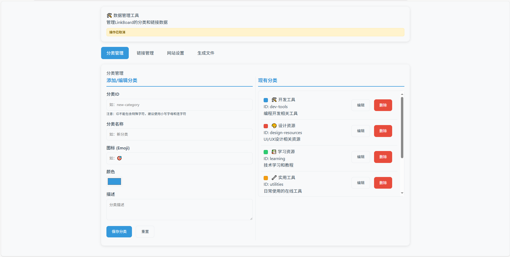
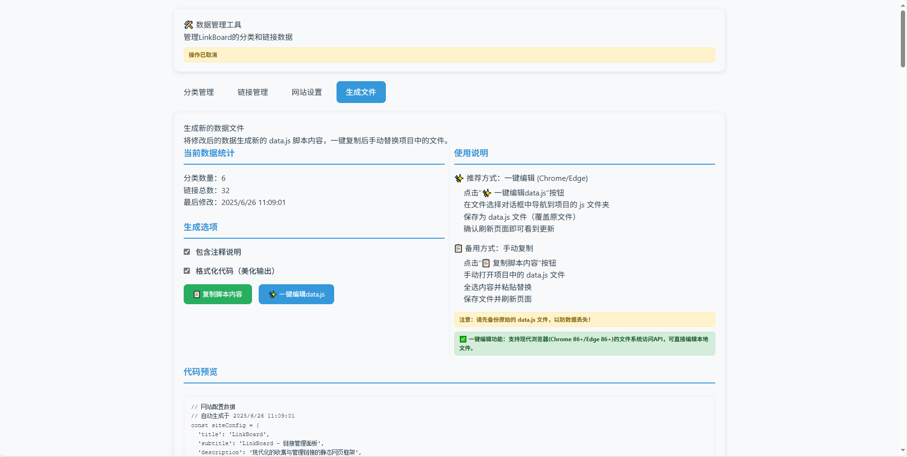

# LinkBoard

[](https://opensource.org/licenses/MIT)
[](https://github.com/JupiterTheWarlock)

## 📖 项目简介

LinkBoard 是一个现代化的收集与管理链接的静态网页框架。专为个人用户设计，用于整理、分类和快速访问常用的网站链接、在线工具和网页资源。这是一个纯前端应用，无需后端服务，部署简单，使用便捷。


*LinkBoard 总览界面 - 展示网站统计和分类概览*


*LinkBoard 全部链接界面 - 支持搜索和标签筛选*

## ✨ 项目特性

- 🏷️ **智能分类**: 左侧分类导航，清晰管理不同类型的链接
- 📊 **数据总览**: Dashboard界面展示链接统计和分类概览
- 🔍 **全文搜索**: 支持链接标题、描述、分类和标签的全文搜索
- 🏷️ **标签系统**: 灵活的标签筛选，快速定位目标资源，无预定义标签约束
- 📱 **响应式设计**: 完美适配桌面端、平板和移动设备
- 💾 **纯静态**: 基于JSON的数据存储，无需数据库和服务器
- 🎨 **现代UI**: 简洁美观的用户界面，支持暗色主题
- ⚙️ **完全自定义**: 可视化设置网站标题、Logo、图标等所有元素
- ⚡ **高性能**: 轻量级设计，快速加载和流畅交互

## 🛠️ 技术栈

- **前端**: HTML5 / CSS3 / Vanilla JavaScript (ES6+)
- **样式**: CSS3 自定义属性，响应式设计
- **数据**: JSON格式数据文件
- **部署**: 支持 GitHub Pages / Netlify / Vercel 等静态托管

## 📁 项目结构

```
LinkBoard/
├── index.html              # 主页面
├── dataManager.html        # 数据管理工具
├── assets/                 # 静态资源文件夹
│   ├── icons/             # 图标文件
│   │   ├── favicon.png    # 网站图标(PNG格式)
│   │   └── favicon.svg    # 网站图标(SVG格式)
│   └── images/            # 图片资源
├── css/                    # 样式文件
│   ├── style.css          # 主样式
│   ├── reset.css          # CSS重置
│   └── responsive.css     # 响应式样式
├── js/                     # JavaScript文件
│   ├── main.js            # 主应用逻辑
│   ├── data.js            # 数据定义
│   ├── tag-manager.js     # 标签管理
│   └── utils.js           # 工具函数
├── docs/                   # 项目文档
│   ├── PLAN.md            # 项目规划
│   └── DEVELOPMENT.md     # 开发指南
├── LICENSE                 # MIT许可证
├── README.md              # 项目说明文档
└── .gitignore             # Git忽略文件配置
```

## 🚀 快速开始

### 1. 克隆项目
```bash
git clone https://github.com/JupiterTheWarlock/LinkBoard.git
cd LinkBoard
```

### 2. 本地运行
```bash
# 方法1: 直接打开 index.html 文件
# 在文件管理器中双击 index.html 即可在浏览器中打开

# 方法2: 使用本地服务器
python -m http.server 8000
# 然后在浏览器中访问 http://localhost:8000

# 或使用Node.js的http-server
npx http-server -p 8000
```

### 3. 自定义数据
推荐使用可视化的数据管理工具 `dataManager.html` 进行数据管理。你也可以直接编辑 `data.js` 文件：

```javascript
// 网站配置
const siteConfig = {
  title: 'My LinkBoard',
  pageTitle: 'My LinkBoard - 我的链接收藏',
  description: '我的个人链接收藏网站',
  favicon: 'https://example.com/favicon.ico',
  logo: {
    text: 'My Links',
    icon: '🌟',
    showIcon: true,
    showText: true
  }
};

// 添加新分类
const categories = [
  {
    id: 'development',
    name: '开发工具',
    description: '编程开发相关工具和资源',
    icon: '⚙️',
    color: '#3498db'
  }
];

// 添加新链接（标签完全自由）
const links = {
  development: [
    {
      title: 'GitHub',
      description: '全球最大的代码托管平台',
      url: 'https://github.com',
      icon: 'https://github.com/favicon.ico',
      tags: ['代码托管', '开源', '协作开发', '版本控制']  // 任意标签
    }
  ]
};
```

### 4. 部署
将整个项目文件夹上传到任何静态网站托管服务即可。

## 💻 系统要求

### 浏览器兼容性
- Chrome 70+ ✅
- Firefox 65+ ✅  
- Safari 12+ ✅
- Edge 79+ ✅

### 本地开发环境（可选）
- Python 3.6+ （用于本地服务器）
- Node.js 12+ （用于http-server）

### 部署支持
- GitHub Pages ✅
- Netlify ✅
- Vercel ✅
- Surge.sh ✅
- 任何静态文件托管服务 ✅

## 📊 功能特性

### Dashboard 总览
- 📈 链接总数统计
- 📂 分类数量展示
- 📊 各分类链接分布

### 链接管理
- 🔗 链接卡片展示
- 🏷️ 标签筛选功能
- 🔍 实时搜索
- 📱 响应式布局

### 数据管理
- 📝 可视化数据编辑（dataManager.html）
- 📥 数据导入导出
- 🔄 实时预览更新

## 🛠️ DataManager 数据管理工具使用指南

LinkBoard 提供了一个强大的可视化数据管理工具 `dataManager.html`，让你无需手动编辑代码就能轻松管理链接和分类数据～ 


*DataManager 分类管理界面 - 可视化管理分类信息*

### 启动数据管理器

有两种方式可以启动数据管理器：

1. **直接双击打开**: 无需服务器，直接双击 `dataManager.html` 文件即可
2. **浏览器访问**: 在项目运行时访问 `http://localhost:8000/dataManager.html`

### 主要功能

#### 📂 分类管理
- **添加分类**: 设置分类ID、名称、图标（Emoji）、颜色和描述
- **编辑分类**: 点击现有分类的"编辑"按钮进行修改
- **删除分类**: 删除分类时会同时删除该分类下的所有链接
- **注意事项**: 分类ID只能包含小写字母、数字和连字符

#### 🔗 链接管理
- **添加链接**: 选择分类，填写标题、URL、描述、图标和标签
- **编辑链接**: 点击现有链接的"编辑"按钮进行修改
- **删除链接**: 单独删除某个链接
- **分类筛选**: 可按分类筛选显示链接
- **灵活标签**: 可使用任意字符串作为标签，无需预定义

#### ⚙️ 网站设置
- **基本信息**: 自定义网站标题、页签标题、描述
- **Logo设置**: 设置侧边栏Logo图标和文字
- **浏览器图标**: 自定义favicon（网站图标）
- **Dashboard配置**: 自定义Dashboard页面的标题和描述
- **SEO设置**: 设置关键词、作者等meta信息
- **功能开关**: 控制搜索、标签筛选等功能的显示

#### 📁 生成数据文件
- **数据统计**: 查看当前分类和链接总数
- **代码预览**: 预览即将生成的 `data.js` 文件内容
- **下载文件**: 一键生成并下载新的数据文件
- **格式选项**: 支持包含注释和代码格式化


*DataManager 生成文件界面 - 预览和导出数据文件*

### 使用步骤

1. **打开管理器**: 双击 `dataManager.html` 或通过浏览器访问
2. **管理数据**: 
   - 在"分类管理"标签页中添加或编辑分类
   - 在"链接管理"标签页中添加或编辑链接
   - 在"网站设置"标签页中自定义网站外观和信息
3. **生成文件**: 
   - 切换到"生成文件"标签页
   - 点击"生成并下载 data.js"按钮
4. **应用更改**: 
   - 将下载的文件重命名为 `data.js`
   - 替换项目中的 `data.js` 文件
   - 刷新主页面即可看到更新

### 安全提示

⚠️ **重要**: 在使用数据管理器之前，请务必备份原始的 `data.js` 文件，以防数据丢失！

### 技术特点

- 🔄 **实时预览**: 修改后立即在界面中看到效果
- 💾 **离线工作**: 无需网络连接，完全本地化操作
- 🎨 **可视化界面**: 友好的图形界面，无需编程知识
- 📱 **响应式设计**: 支持在手机和平板上使用
- ⚙️ **完全定制**: 从网站标题到图标，一切都可以自定义
- 🏷️ **灵活标签**: 无需预定义，可使用任意字符串作为标签

## 🎯 使用场景

- **个人书签管理**: 替代浏览器书签，提供更好的组织和搜索体验
- **团队资源收集**: 整理团队常用工具和资源链接
- **学习资料整理**: 分类管理学习网站和在线课程
- **项目资源汇总**: 收集项目相关的文档、工具和参考资料

## ❓ 常见问题

### Q: 如何添加新的链接？
A: 推荐使用 `dataManager.html` 数据管理工具，它提供了可视化界面来添加、编辑和删除链接，无需手动编辑代码。

### Q: 数据存储在哪里？
A: 所有数据都存储在 `data.js` 文件中，这是一个纯JavaScript文件，可以通过Git进行版本控制。

### Q: 如何备份我的数据？
A: 只需要备份 `data.js` 文件即可，它包含了所有的分类、链接和配置信息。

### Q: 可以导入浏览器书签吗？
A: 目前不支持直接导入浏览器书签，但可以通过数据管理工具手动添加链接。

### Q: 支持多用户吗？
A: 这是一个静态网站，不支持用户系统。每个部署的实例都是独立的。

### Q: 如何自定义主题？
A: 可以通过修改 `css/style.css` 文件来自定义颜色、字体等样式，或者在数据管理工具中设置主题颜色。

### Q: 可以添加密码保护吗？
A: 作为静态网站，本身不支持密码保护。可以通过托管平台（如Netlify）提供的访问控制功能来实现。

## 🤝 贡献指南

1. Fork 本项目
2. 创建功能分支 (`git checkout -b feature/AmazingFeature`)
3. 提交更改 (`git commit -m 'Add some AmazingFeature'`)
4. 推送到分支 (`git push origin feature/AmazingFeature`)
5. 创建 Pull Request


## 📄 许可证

本项目采用 MIT 许可证 - 查看 [LICENSE](LICENSE) 文件了解详情

## 📧 联系方式

- 项目链接: [https://github.com/JupiterTheWarlock/LinkBoard](https://github.com/JupiterTheWarlock/LinkBoard)
- 问题反馈: [Issues](https://github.com/JupiterTheWarlock/LinkBoard/issues)

---

⭐ 如果这个项目对你有帮助，请给它一个星标！
