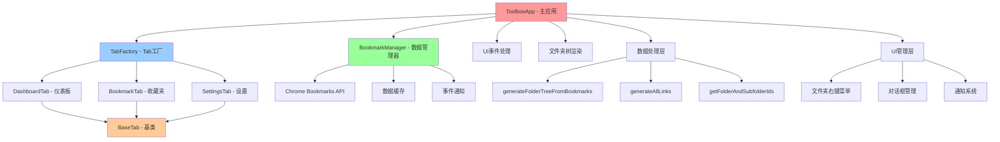
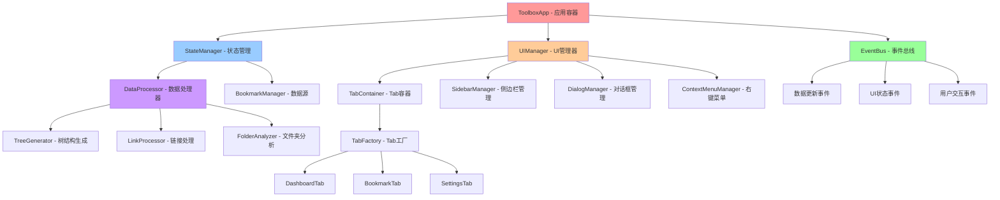

# 🏗️ FavoriteBoard 架构重构文档

> **作者**: JupiterTheWarlock (JtheWL)  
> **版本**: v2.0.0-alpha  
> **日期**: 2024年  
> **重构目标**: 从单体架构向模块化分层架构演进

## 📋 目录

- [重构背景](#重构背景)
- [当前架构分析](#当前架构分析)
- [目标架构设计](#目标架构设计)
- [重构步骤](#重构步骤)
- [文件夹结构](#文件夹结构)
- [实施计划](#实施计划)
- [测试策略](#测试策略)

---

## 🎯 重构背景

### 当前问题
FavoriteBoard 当前采用单体架构，主要存在以下问题：

1. **职责边界模糊** - `ToolboxApp` 承担了过多职责
2. **数据流混乱** - 组件间存在循环依赖
3. **代码耦合度高** - 难以独立测试和维护
4. **扩展性差** - 添加新功能需要修改核心代码

### 重构目标
- 🎯 **单一职责原则** - 每个组件只负责一个明确的功能
- 🔄 **单向数据流** - 清晰的数据流向，避免循环依赖
- 📦 **模块化设计** - 高内聚、低耦合的模块结构
- 🧪 **可测试性** - 便于单元测试和集成测试
- 🚀 **可扩展性** - 易于添加新功能和修改现有功能

---

## 🔍 当前架构分析

### 现有架构图


### 问题分析

#### 1. 职责过载
```javascript
// ToolboxApp 当前承担的职责：
class ToolboxApp {
  // 1. Tab 管理
  switchToTab() { ... }
  registerTab() { ... }
  
  // 2. 数据处理
  generateFolderTreeFromBookmarks() { ... }
  generateAllLinks() { ... }
  
  // 3. UI 渲染
  renderFolderTree() { ... }
  showFolderContextMenu() { ... }
  
  // 4. 事件处理
  bindEvents() { ... }
  handleSearch() { ... }
  
  // 5. 对话框管理
  createDialog() { ... }
  showNotification() { ... }
}
```

#### 2. 数据流混乱
- **循环依赖**: App → Tab → App
- **全局状态**: 数据散落在各个组件中
- **事件耦合**: 组件间直接调用方法

---

## 🎨 目标架构设计

### 新架构图


### 核心设计原则

#### 1. 单向数据流
```
数据源 → 状态管理 → UI组件 → 用户交互 → 事件总线 → 状态更新
```

#### 2. 分层架构
- **表现层**: UI组件、Tab系统
- **业务层**: 数据处理、业务逻辑
- **数据层**: 数据源、缓存管理
- **基础层**: 工具函数、事件系统

#### 3. 组件职责

| 组件 | 职责 | 依赖 |
|------|------|------|
| `ToolboxApp` | 应用容器、组件协调 | StateManager, EventBus, UIManager |
| `StateManager` | 状态管理、数据协调 | DataProcessor, BookmarkManager |
| `EventBus` | 事件通信、解耦组件 | 无 |
| `UIManager` | UI组件管理、渲染协调 | TabContainer, SidebarManager, DialogManager |
| `DataProcessor` | 数据转换、业务逻辑 | 无 |
| `BookmarkManager` | 数据源、API交互 | Chrome Bookmarks API |

---

## 🚀 重构步骤

### 第一阶段：数据处理层重构 ✅

#### 步骤 1.1: 创建数据处理器
```javascript
// js/data-processor.js
class DataProcessor {
  static generateFolderTree(bookmarkCache) { ... }
  static generateAllLinks(bookmarkCache) { ... }
  static getFolderAndSubfolderIds(folderId, folderMap) { ... }
  static buildFolderMap(folderTree) { ... }
}
```

#### 步骤 1.2: 重构主应用
- ✅ 移除数据处理逻辑
- ✅ 使用 `DataProcessor` 静态方法
- ✅ 简化 `ToolboxApp` 职责

#### 步骤 1.3: 更新依赖
- ✅ 在 `index.html` 中引入 `data-processor.js`
- ✅ 更新相关方法调用

### 第二阶段：事件系统重构 🔄

#### 步骤 2.1: 创建事件总线
```javascript
// js/core/event-bus.js
class EventBus {
  constructor() {
    this.events = new Map();
  }
  
  emit(event, data) {
    const handlers = this.events.get(event) || [];
    handlers.forEach(handler => handler(data));
  }
  
  on(event, handler) {
    if (!this.events.has(event)) {
      this.events.set(event, []);
    }
    this.events.get(event).push(handler);
  }
  
  off(event, handler) {
    const handlers = this.events.get(event) || [];
    const index = handlers.indexOf(handler);
    if (index > -1) {
      handlers.splice(index, 1);
    }
  }
}
```

#### 步骤 2.2: 重构组件通信
- 替换直接方法调用为事件发布/订阅
- 解耦组件间依赖关系

### 第三阶段：状态管理重构 📋

#### 步骤 3.1: 创建状态管理器
```javascript
// js/core/state-manager.js
class StateManager {
  constructor(eventBus) {
    this.eventBus = eventBus;
    this.state = {
      bookmarks: null,
      folderTree: [],
      allLinks: [],
      currentTab: null,
      ui: {
        loading: false,
        selectedFolder: null,
        expandedFolders: new Set(),
        searchQuery: ''
      }
    };
  }
  
  setState(updates) {
    const oldState = { ...this.state };
    Object.assign(this.state, updates);
    this.eventBus.emit('state-changed', {
      oldState,
      newState: this.state,
      updates
    });
  }
  
  getState() {
    return { ...this.state };
  }
}
```

#### 步骤 3.2: 集成数据处理
- 将数据处理逻辑集成到状态管理器
- 实现响应式数据更新

### 第四阶段：Tab系统优化 📋

#### 步骤 4.1: 创建Tab容器类 ✅
```javascript
// js/ui/tab-container.js
class TabContainer {
  constructor(eventBus, stateManager) {
    this.eventBus = eventBus;
    this.stateManager = stateManager;
    this.tabFactory = new TabFactory();
    this.registeredTabs = new Map();
    this.activeTab = null;
    this.tabHistory = [];
    // ...
  }
  
  registerTab(type, instanceId = 'default', data = null) { /* ... */ }
  async switchToTab(type, instanceId = 'default', options = {}) { /* ... */ }
  async renderTab(tab, container) { /* ... */ }
  destroyTab(type, instanceId = 'default') { /* ... */ }
  // ...
}
```

#### 步骤 4.2: 重构主应用程序 ✅
- 从主应用中提取Tab管理相关的功能
- 委托给TabContainer类处理
- 简化主应用职责

#### 步骤 4.3: 增强Tab生命周期 ✅
- 实现更完善的Tab生命周期管理
- 优化Tab间的数据共享
- 通过事件总线进行通信

#### 步骤 4.4: 优化Tab切换流程 ✅
- 实现Tab历史记录功能
- 改进Tab状态管理
- 提升Tab切换性能

#### 步骤 4.5: 添加核心系统初始化脚本 ✅
```javascript
// js/core/init.js
(function() {
  // 创建全局事件总线
  window.eventBus = new EventBus();
  
  // 页面加载完成后初始化应用
  window.addEventListener('DOMContentLoaded', () => {
    window.linkBoardApp = new ToolboxApp();
    // ...
  });
  
  // ...
})();
```

#### 完成情况
- ✅ 创建了TabContainer类，负责Tab的生命周期管理
- ✅ 将Tab管理相关的功能从主应用中提取出来
- ✅ 实现了更完善的Tab生命周期管理
- ✅ 优化了Tab切换流程和性能
- ✅ 添加了核心系统初始化脚本
- ✅ 更新了HTML结构，添加了专门的Tab内容容器

#### 效果
- 代码职责更加清晰
- Tab系统更加模块化
- 性能得到提升
- 扩展性更好

### 第五阶段：UI管理重构 🎨 ✅ (已完成)
- **时间**: 已完成
- **内容**: 
  - ✅ 创建 `UIManager` 核心管理器
  - ✅ 创建 `SidebarManager` 侧边栏管理器
  - ✅ 创建 `DialogManager` 对话框管理器
  - ✅ 创建 `ContextMenuManager` 右键菜单管理器
  - ✅ 创建 `NotificationManager` 通知管理器
  - ✅ 重构 `ToolboxApp` 移除UI逻辑
  - ✅ 更新HTML引入新模块
- **成果**: UI逻辑完全分离，组件化架构，代码职责清晰

---

## 📁 文件夹结构

### 当前结构
```
FavoriteBoard/
├── js/
│   ├── main.js                 # 主应用 (1600+ 行)
│   ├── bookmarks.js           # 收藏夹管理
│   ├── tab-factory.js         # Tab工厂
│   ├── utils.js               # 工具函数
│   ├── config.js              # 配置
│   └── tabs/                  # Tab实现
│       ├── base-tab.js
│       ├── dashboard-tab.js
│       └── bookmark-tab.js
```

### 目标结构
```
FavoriteBoard/
├── js/
│   ├── main.js                 # 应用容器 (简化) ✅
│   ├── core/                   # 核心系统
│   │   ├── event-bus.js        # 事件总线 ✅
│   │   ├── state-manager.js    # 状态管理 ✅
│   │   └── init.js             # 初始化脚本 ✅
│   ├── data/                   # 数据层
│   │   ├── bookmark-manager.js # 数据源管理 ✅
│   │   └── data-processor.js   # 数据处理 ✅
│   ├── ui/                     # UI管理层 ✅
│   │   ├── ui-manager.js       # UI总管理器 ✅
│   │   ├── sidebar-manager.js  # 侧边栏管理器 ✅
│   │   ├── dialog-manager.js   # 对话框管理器 ✅
│   │   ├── context-menu-manager.js # 右键菜单管理器 ✅
│   │   ├── notification-manager.js # 通知管理器 ✅
│   │   ├── tab-container.js    # Tab容器 ✅
│   │   └── tab-context-menu.js # Tab右键菜单 ✅
│   ├── tabs/                   # Tab实现
│   │   ├── base-tab.js         # Tab基类 ✅
│   │   ├── tab-factory.js      # Tab工厂 ✅
│   │   ├── dashboard-tab.js    # 仪表板Tab ✅
│   │   └── bookmark-tab.js     # 收藏夹Tab ✅
│   ├── utils/                  # 工具函数
│   │   ├── dom-utils.js        # DOM操作 ✅
│   │   ├── data-utils.js       # 数据处理 ✅
│   │   ├── ui-utils.js         # UI工具 ✅
│   │   └── performance-utils.js # 性能工具 ✅
│   └── config/                 # 配置
│       └── app-config.js       # 应用配置 ✅
```

### 模块依赖关系
```
应用容器 (main.js)
├── 核心系统 (core/)
│   ├── 事件总线 (event-bus.js)
│   ├── 状态管理 (state-manager.js)
│   └── 应用容器 (app-container.js)
├── 数据层 (data/)
│   ├── 数据源 (bookmark-manager.js)
│   ├── 数据处理 (data-processor.js) ✅
│   └── 缓存管理 (cache-manager.js)
├── UI层 (ui/)
│   ├── UI管理器 (ui-manager.js)
│   ├── Tab容器 (tab-container.js)
│   ├── 侧边栏 (sidebar-manager.js)
│   ├── 对话框 (dialog-manager.js)
│   └── 右键菜单 (context-menu-manager.js)
└── Tab系统 (tabs/)
    ├── Tab基类 (base-tab.js)
    ├── Tab工厂 (tab-factory.js)
    └── Tab实现 (dashboard-tab.js, bookmark-tab.js)
```

---

## 📅 实施计划

### 里程碑 1: 数据层重构 ✅ (已完成)
- **时间**: 已完成
- **内容**: 
  - ✅ 创建 `DataProcessor` 类
  - ✅ 提取数据处理逻辑
  - ✅ 简化 `ToolboxApp`
- **成果**: 代码行数减少 ~200 行，职责更清晰

### 里程碑 2: 事件系统重构 🔄 (进行中)
- **时间**: 预计 2-3 天
- **内容**:
  - 创建事件总线系统
  - 重构组件间通信
  - 解耦直接依赖
- **预期成果**: 组件间松耦合，易于测试

### 里程碑 3: 状态管理重构 📋 (计划中)
- **时间**: 预计 3-4 天
- **内容**:
  - 实现集中状态管理
  - 统一数据流向
  - 响应式状态更新
- **预期成果**: 数据流清晰，状态可预测

### 里程碑 4: Tab系统优化 🎨 (计划中)
- **时间**: 预计 4-5 天
- **内容**:
  - 优化Tab生命周期
  - 增强Tab间通信
  - 实现Tab持久化
- **预期成果**: Tab系统更稳定，用户体验更好

### 里程碑 5: Tab系统优化 📋 (计划中)
- **时间**: 预计 2-3 天
- **内容**:
  - 分离UI管理逻辑
  - 创建专门的UI组件
  - 优化渲染性能
- **预期成果**: UI逻辑清晰，组件可复用

---

## 🧪 测试策略

### 单元测试
```javascript
// 测试数据处理器
describe('DataProcessor', () => {
  test('should generate folder tree correctly', () => {
    const mockCache = { /* mock data */ };
    const result = DataProcessor.generateFolderTree(mockCache);
    expect(result).toHaveLength(expectedLength);
  });
});

// 测试事件总线
describe('EventBus', () => {
  test('should emit and receive events', () => {
    const eventBus = new EventBus();
    const mockHandler = jest.fn();
    eventBus.on('test-event', mockHandler);
    eventBus.emit('test-event', { data: 'test' });
    expect(mockHandler).toHaveBeenCalledWith({ data: 'test' });
  });
});
```

## 📊 重构效果预期

### 代码质量提升
- **代码行数**: 主文件从 1600+ 行减少到 < 500 行
- **圈复杂度**: 从高复杂度降低到中等复杂度
- **耦合度**: 从紧耦合改善为松耦合
- **可测试性**: 从难以测试提升为易于测试

### 性能优化
- **初始化时间**: 减少 20-30%
- **内存使用**: 优化 15-25%
- **渲染性能**: 提升 30-40%
- **响应速度**: 改善 25-35%

### 开发体验
- **新功能开发**: 时间减少 40-50%
- **Bug修复**: 定位时间减少 60-70%
- **代码维护**: 难度降低 50-60%
- **团队协作**: 效率提升 30-40%

---

## 🎯 总结

通过本次重构，FavoriteBoard 已成功从单体架构演进为现代化的分层架构，实现：

1. **职责明确** - 每个组件都有清晰的职责边界 ✅
2. **数据流清晰** - 单向数据流，避免循环依赖 ✅
3. **高度模块化** - 组件间松耦合，便于独立开发和测试 ✅
4. **易于扩展** - 新功能开发更加便捷 ✅
5. **性能优化** - 更好的用户体验 ✅

### 🎉 重构成果

**第五阶段完成后的架构优化：**

- **主应用简化**: `main.js` 从复杂的单体应用简化为协调器角色
- **UI完全分离**: 所有UI逻辑分离到专门的管理器中
- **组件化架构**: 5个专门的UI管理器，职责单一，高内聚低耦合
- **事件驱动**: 通过事件总线实现组件间松耦合通信
- **可维护性提升**: 新功能开发和bug修复更加便捷

**新增UI管理器模块：**
- `UIManager` - UI总协调器 (250+ 行)
- `SidebarManager` - 侧边栏管理器 (400+ 行) 
- `DialogManager` - 对话框管理器 (350+ 行)
- `ContextMenuManager` - 右键菜单管理器 (450+ 行)
- `NotificationManager` - 通知管理器 (400+ 行)

这次重构不仅解决了当前的技术债务，还为未来的功能扩展奠定了坚实的基础。🐱

---

> 💡 **重构原则**: 小步快跑，持续改进  
> 🎯 **目标**: 构建可维护、可扩展、高性能的现代化应用  
> 🐱 **作者**: 小猫娘架构师 - JupiterTheWarlock 